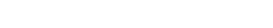
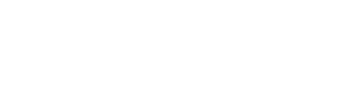
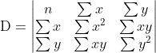
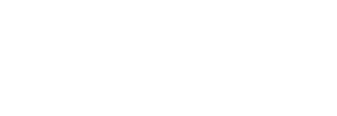
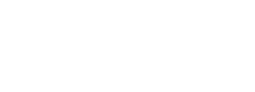
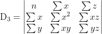
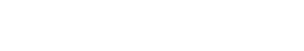
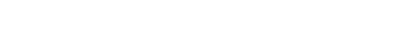

# Linear Regression in Leo

This repository contains a Leo program that performs linear regression on a set of data points using the method of least squares. The implementation is designed to calculate the coefficients of a linear model that best fits the input data. The model is of the form:

## Methodology

### Fitting the Model

The algorithm uses the method of least squares to find the coefficients `a`, `b₁`, and `b₂` that minimize the sum of the squared residuals between the observed and predicted values of `z`. 

To solve for the coefficients, we set up and solve a system of linear equations derived from the partial derivatives of the loss function with respect to each coefficient. The system of equations to be solved is:

### Solving the System

The system of linear equations is solved using Cramer's rule. Cramer's rule is an explicit formula for the solution of a system of linear equations with as many equations as unknowns, valid whenever the system has a unique solution. It expresses the solution in terms of the determinants of the coefficient matrix and matrices obtained by replacing one column by the column of constants.

The determinants are calculated as follows:

And the solutions are given by:

### Prediction

Once the coefficients are determined, predictions can be made for new values of `x` and `y` using the model:

## Usage

The `linear_regression.aleo` program consists of functions that facilitate the fitting and prediction process:

- `fit_transition`: Accepts input data points and returns the coefficients of the linear model.
- `predict_transition`: Accepts values of `x` and `y` along with the model coefficients, and returns the predicted value of `z`.
- `fit_predict_transition`: Combines fitting and prediction, returning the predicted values of `z` for the input data points.

## Conclusion

This Leo implementation offers a robust way to perform linear regression using the method of least squares, providing a foundation for predictive modeling in a privacy-preserving and verifiable manner on the [Aleo](https://aleo.org/) platform.
